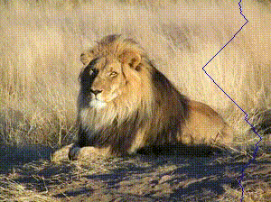
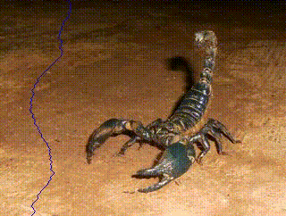
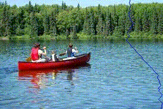

## 1. About the Project <a name="atp"></a>
 **Course:**  Applied Image Processing (CS4365) \
 **Program:** Msc Robotics @ TU Delft            
 **Developer:**    Jakob Bichler    
 **Student ID** 5856795  
 **GitLab Repo** [Click to go to GitLab](https://gitlab.ewi.tudelft.nl/cgv/cs4365/student-repositories/2023-2024/cs436523jbichler)   

This repository is the submission for the final assignment of the course **Applied Image Processing, "Seam-Carved Vectorization"**.

For further (visual) explanations on how the algorithm works, see the [Report](aip_final_report_bichler.pdf).





--- 

## Table of Contents

1. [About the Project](#atp) 

2. [Setting up the project in a new virtual environment](#setup)

3. [Usage](#u)

4. [Links to algorithmic steps](#as)
    
5. [File Structure](#fs)


## 2. Setting up the project in a new virtual environment [LINUX]<a name="setup"></a>

Follow these steps to set up the project on a Linux machine in a new Python virtual environment:

### 2.1.  (Optional) Install the `python3.8-venv` package
If you don't have the `python3.8-venv` package installed, you can install it using:

```
sudo apt install python3.8-venv
```
### 2.2. Create a new virtual environment
Navigate to the directory where you'd like to set up your virtual environment and run:

```
python3.8 -m venv aip_env
```

This command will create a new virtual environment named aip_env. You can **replace ``aip_env`` with any name you prefer**.

### 2.3. Activate the virtual environment

```
cd aip_env
```

```
source bin/activate
```
After running this command, your terminal prompt should change to indicate that the virtual environment is active.

### 2.4. Clone the repository
```
git clone git@gitlab.ewi.tudelft.nl:cgv/cs4365/student-repositories/2023-2024/cs436523jbichler.git
```
```
cd cs436523jbichler
```

### 2.5. Install the required packages

With your virtual environment activated, install the necessary packages using:
```
pip install -r requirements.txt
```
Now, your project is set up and ready to run in a fresh virtual environment.

## 3. Usage <a name="u"></a>

To run the `seam_carving.py` script, you can use the following command:

```bash
python3 seam_carving.py --image_path IMAGE_PATH --class_id CLASS_ID --n_cols N_COLS --n_rows N_ROWS --depth_weight DEPTH_WEIGHT [--show_steps]
```

### 3.1. Arguments


-- image_path: Path to the input image. For example: "data/images/lion.jpg".

 -- class_id: ImageNet class to perform Grad-CAM with. Example value: 291 for lion. All 1000 ImageNet classes are possible. For reference: [List of all ImageNet labels](https://deeplearning.cms.waikato.ac.nz/user-guide/class-maps/IMAGENET/)

-- n_cols: Number of vertical seams to remove

-- n_rows: Number of horizontal seams to remove

-- depth_weight: Weight for the depth estimate in the combination of inpainted heatmap from Gradcam, gradient energy and depth estimation

-- show_steps: (Optional) Flag. If provided, the script will show and save intermediate steps. There's no need to provide a value for this flag. It will save intermediate output images and create a video displaying the steps of seam carving. 

NOTE: that this will slow down the script, especially when the vectorized (stretched) triangles are plotted. If you want to run the script quickly, don't use this flag. 


Example:
```
python3 seam_carving.py --image_path "data/images/lion.jpg" --class_id 291 --n_cols 3 --n_rows 3  --depth_weight 0.3 --show_steps
```

### 3.2. Inputs
The script can run on any ``.jpg`` image that you download to the ``data/images`` directory.

Four sample images and their smaller versions (quicker runtime and debugging) are provided:

- ``lion.jpg`` and ``lion_small.jpg`` with corresponding ``class_id 291`` for lion

- ``canoe.jpg`` and ``canoe_small.jpg`` with corresponding ``class_id 472`` for canoe

- ``cat_dog.jpg`` and ``cat_dog_small.jpg`` with corresponding ``class_id 283`` for Persian cat 

- ``scorpion.jpg`` and ``scorpion_small.jpg`` with corresponding ``class_id 71`` for scorpion 


### 4. Links to algorithmic steps<a name="as"></a>

#### Basic features

1. Load an RGB image from disk

    [Call in main script](https://gitlab.ewi.tudelft.nl/cgv/cs4365/student-repositories/2023-2024/cs436523jbichler/-/blob/main/seam_carving.py?ref_type=heads#L71-72)

2. Run a pretrained CNN for image detection

    [Definition in models/vgg/vgg.py](https://gitlab.ewi.tudelft.nl/cgv/cs4365/student-repositories/2023-2024/cs436523jbichler/-/blob/main/models/vgg19/vgg.py?ref_type=heads#L56-66)

    [Call in main script](https://gitlab.ewi.tudelft.nl/cgv/cs4365/student-repositories/2023-2024/cs436523jbichler/-/blob/main/seam_carving.py?ref_type=heads#L86)


3. Extract a feature map from a CNN using Grad-Cam

    [Definition in models/vgg/vgg.py](https://gitlab.ewi.tudelft.nl/cgv/cs4365/student-repositories/2023-2024/cs436523jbichler/-/blob/main/models/vgg19/vgg.py?ref_type=heads#L70-103)

    [Call in main script](https://gitlab.ewi.tudelft.nl/cgv/cs4365/student-repositories/2023-2024/cs436523jbichler/-/blob/main/seam_carving.py?ref_type=heads#L86)

4. Modify the feature map by painting

    [Definition in utils/grad_cam_utils.py](https://gitlab.ewi.tudelft.nl/cgv/cs4365/student-repositories/2023-2024/cs436523jbichler/-/blob/main/utils/grad_cam_utils.py?ref_type=heads#L36-117)

    [Call in main script](https://gitlab.ewi.tudelft.nl/cgv/cs4365/student-repositories/2023-2024/cs436523jbichler/-/blob/main/seam_carving.py?ref_type=heads#L88)

5. Use the map as a guide for seam carving and remove pixel columns with low values

    [Definition in utils/carving_utils.py](https://gitlab.ewi.tudelft.nl/cgv/cs4365/student-repositories/2023-2024/cs436523jbichler/-/blob/main/utils/carving_utils.py?ref_type=heads#L9-192)

    [Call in main script](https://gitlab.ewi.tudelft.nl/cgv/cs4365/student-repositories/2023-2024/cs436523jbichler/-/blob/main/seam_carving.py?ref_type=heads#L130)


    NOTE: The provided link uses a combined costmap considering the Grad-Cam features, estimated depth from second CNN and the energy map that is usually used for seam carving (gradients in x,y). It then also removes rows instead of only columns to enable resizing in height and width.

6. Vectorize the remaining pixels by replacing them by triangle pairs


    [Definition in utils/vectorization_utils.py](https://gitlab.ewi.tudelft.nl/cgv/cs4365/student-repositories/2023-2024/cs436523jbichler/-/blob/main/utils/vectorization_utils.py?ref_type=heads#L11-64)

    [Call in main script](https://gitlab.ewi.tudelft.nl/cgv/cs4365/student-repositories/2023-2024/cs436523jbichler/-/blob/main/seam_carving.py?ref_type=heads#L157-159)

7. Move the vectors back to their original positions by "uncarving" 

    [Definition in utils/vectorization_utils.py](https://gitlab.ewi.tudelft.nl/cgv/cs4365/student-repositories/2023-2024/cs436523jbichler/-/blob/main/utils/vectorization_utils.py?ref_type=heads#L136-183)

    [Call in main script](https://gitlab.ewi.tudelft.nl/cgv/cs4365/student-repositories/2023-2024/cs436523jbichler/-/blob/main/seam_carving.py?ref_type=heads#L163)

    Note: This already includes uncarving removed vertical and horizontal seams. 

8. Smoothly interpolate the colors in the stretched vector graphics and rasterize it back 

    [Definition in utils/vectorization_utils.py](https://gitlab.ewi.tudelft.nl/cgv/cs4365/student-repositories/2023-2024/cs436523jbichler/-/blob/main/utils/vectorization_utils.py?ref_type=heads#L327-379)

    [Call in main script](https://gitlab.ewi.tudelft.nl/cgv/cs4365/student-repositories/2023-2024/cs436523jbichler/-/blob/main/seam_carving.py?ref_type=heads#L180)

9. Save and display the result

    [Call in main script](https://gitlab.ewi.tudelft.nl/cgv/cs4365/student-repositories/2023-2024/cs436523jbichler/-/blob/main/seam_carving.py?ref_type=heads#L185-190)

#### Extended features

1. Visualize the steps of carving

    1.1 In the video (see GIFS in this README) 

    [Definition in utils/carving_utils.py](https://gitlab.ewi.tudelft.nl/cgv/cs4365/student-repositories/2023-2024/cs436523jbichler/-/blob/main/utils/carving_utils.py?ref_type=heads#L158-169)

    [Call in main script](https://gitlab.ewi.tudelft.nl/cgv/cs4365/student-repositories/2023-2024/cs436523jbichler/-/blob/main/seam_carving.py?ref_type=heads#L130)

    NOTE: when flag ``out`` is set (by setting ``show_steps`` from the command line) then the video is created when removing the seams. 

    1.2 In a static image, all removed pixels are highlighted
    
    [Definition in utils/visualisation_utils.py](https://gitlab.ewi.tudelft.nl/cgv/cs4365/student-repositories/2023-2024/cs436523jbichler/-/blob/main/utils/visualisations_utils.py?ref_type=heads#L88-167)

    [Call in main script](https://gitlab.ewi.tudelft.nl/cgv/cs4365/student-repositories/2023-2024/cs436523jbichler/-/blob/main/seam_carving.py?ref_type=heads#L143-147)

2. Add another CNN with features conditioned on a different type of user input
    
    [Definition in models/midas_depth/model_midas.py](https://gitlab.ewi.tudelft.nl/cgv/cs4365/student-repositories/2023-2024/cs436523jbichler/-/blob/main/models/midas_depth/model_midas.py?ref_type=heads#L8-53)

    [Call in main script](https://gitlab.ewi.tudelft.nl/cgv/cs4365/student-repositories/2023-2024/cs436523jbichler/-/blob/main/seam_carving.py?ref_type=heads#L107)

    NOTE: The MiDaS depth estimator CNN is used here. It outputs a feature map that is then combined with both the inpainted feature map from Grad-Cam as well as the energy map from gradients in x.z to guide the seam carving algorithm. It performs monocular depth estimation. Objects that are closer to the camera, have a higher cost to seam carve through.

3. Devise a strategy for orientation of triangle diagonals 

    [Definition in utils/vectorization_utils.py](https://gitlab.ewi.tudelft.nl/cgv/cs4365/student-repositories/2023-2024/cs436523jbichler/-/blob/main/utils/vectorization_utils.py?ref_type=heads#L68-100)

    [Call in main script](https://gitlab.ewi.tudelft.nl/cgv/cs4365/student-repositories/2023-2024/cs436523jbichler/-/blob/main/seam_carving.py?ref_type=heads#L158)

    NOTE: The triangle diagonals are chosen based on the cost map of the carved image that takes into 
    account grad_cam, depth, and energy map (gradients). The function evaluates which diagonal orientation has the lowest cumulative cost and chooses that orientation for the triangle in the output mesh. 


### 3. File structure <a name="fs"></a>
```
├── data
│   └── images                      # Example images, can be extended
│       ├── canoe.jpg
│       ├── canoe_small.jpg
│       ├── cat_dog.jpg
│       ├── cat_dog_small.jpg
│       ├── lion.jpg
│       ├── lion_small.jpg
│       ├── scorpion.jpg
│       └── scorpion_small.jpg
├── models
│   ├── midas_depth                 # Depth estimation CNN
│   │   ├── model_midas.py
│   ├── resnet                      # Resnet image classifier, not used in final solution
│   │   ├── 91class.names
│   │   └── resnet.py
│   ├── vgg19                       # VGG image classifier
│   │   └── vgg.py
│   ├── yolov3                      # Yolo v3 object detecion, not used in final solution
│   │   ├── class.names
│   │   ├── yolo_dnn.py
│   │   ├── yolov3.cfg
│   │   └── yolov3.weights
│   └── yolov8                      # Yolo v8 object detecion, not used in final solution
│       ├── yolo_ultra.py
│       └── yolov8m.pt
├── outputs                         # Directory for generated outputs
├── README.md
├── requirements.txt                
├── seam_carving.py                 # Main script
└── utils                           # Utility functions
    ├── carving_utils.py
    ├── grad_cam_utils.py
    ├── vectorization_utils.py
    └── visualisations_utils.py
```


